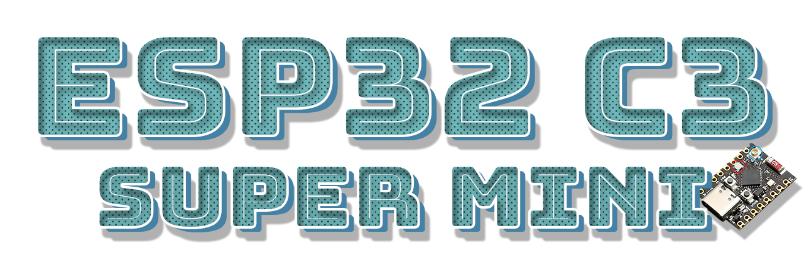

<h4>Repo Under Construction</h4>

 

<b>Sample projects & more for the esp32 C3 Supermini. Make sure you keep the ino file in a folder titled same as the ino.</b>

 

___

## 📁 Repo Directory 📁

- <a href=https://github.com/ATOMNFT/ESP32-C3-Hub/tree/main/Sketches>Sketches</a>
- <a href=#>Info</a>
  
  

  
### Device Compatibility

These sketches Successfully tested on
- [Amazon\*]()
- [Amazon\*]()
- [Aliexpress\*]()

---

